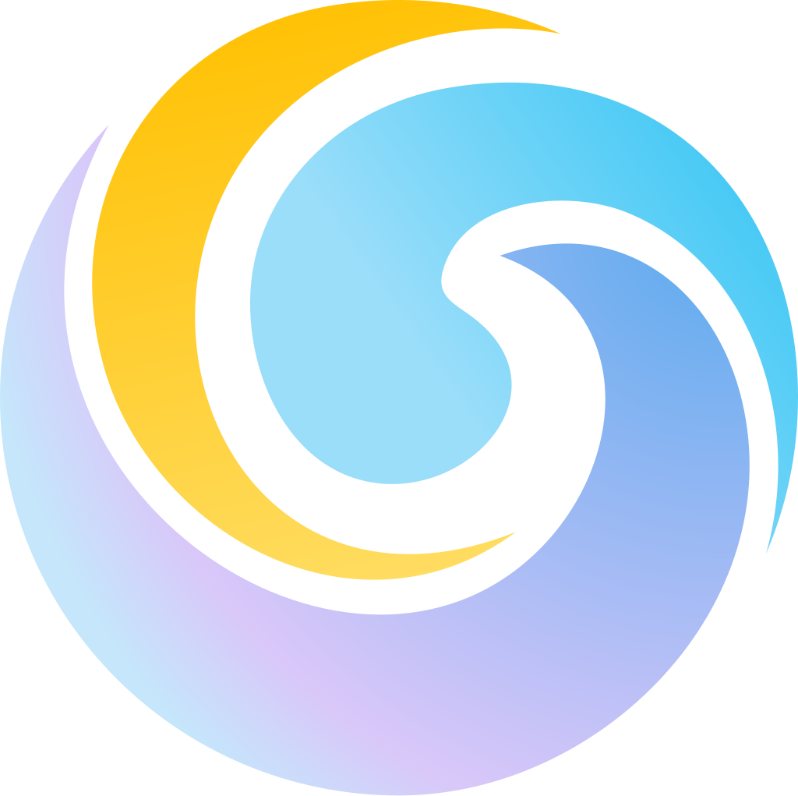

	 
	
	<h1>flowser.dev</h1>
	

		<b>Easily start you local Flow network & inspect the state.</b>
	

	 
	 

This repository was forked and adapted from [transitive-bullshit/nextjs-notion-starter-kit](https://github.com/transitive-bullshit/nextjs-notion-starter-kit).

## Setup

If your using MacOS with ARM chip, check out this issue: https://github.com/lovell/sharp/issues/2460#issuecomment-751491241.

